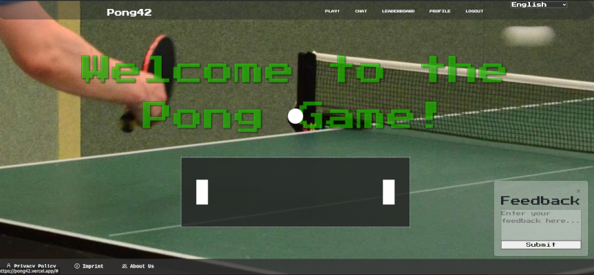

# 🏓 Pong-withBugs-testing 🏓

# Pure JS (vanilla) frontend + Django backend

Project Description:
This project, Pong-withBugs-testing, is a modified version of the original pong42 created for the ft_transcendence course. Built using a Django backend and vanilla JavaScript frontend, this version intentionally includes bugs.
## The goal is to provide a hands-on environment for testing and debugging in workshop settings, helping participants practice identifying and solving issues.

[Website](https://pong-with-bugs-testing.vercel.app/#login)
